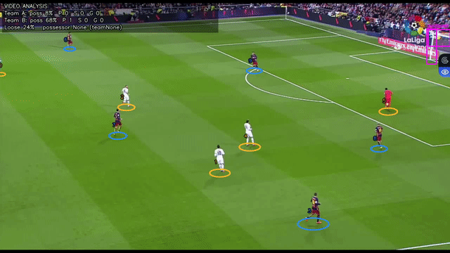

# Football Clip Stats

Broadcast soccer clip → player/ball detections → tracks → team IDs → **possession, passes, shots, goals**.



YOLOv9c (5 classes) · ByteTrack · jersey KMeans · pitch homography (105×68 m) · geometry event engine.

Weights and match videos are **not** in git (size + copyright). Place `models/best.pt` locally. Training belongs on **Kaggle GPU**; clip analysis belongs **here**.

---

## Pipeline

```
VIDEO
  → YOLO (ball, player, goalkeeper, referee, goalpost)
  → ByteTrack
  → Team colors (torso KMeans)
  → Homography
  → StatEngine
       ├── possession (hold through a pass until interception)
       ├── passes
       ├── shots / shots on target
       └── goals
  → overlay + JSON/CSV report
```

Players render as **ground ovals at the feet** (boxes stay internal). The ball keeps a bounding box.

## Quick start

```bash
python -m venv .venv
source .venv/bin/activate
pip install -r requirements.txt

# weights: models/best.pt
# classes: ball, player, goalkeeper, referee, goalpost

python run_clip.py --source input_videos/yourclip.mp4 --no-cache
python scripts/evaluate_clip.py --source input_videos/yourclip.mp4 --gt evaluation/gt/elclasico.json
```

| Output | What it is |
| --- | --- |
| `{clip}_stats.json` | Possession, passes, shots, goals, events in meters |
| `{clip}_eval.mp4` | Overlay video (ovals, ball box, HUD) |
| `{clip}_eval_report.txt` | Text summary vs optional ground truth |

Pitch calibration: [CALIBRATION.md](CALIBRATION.md). Pipeline details: [PIPELINE.md](PIPELINE.md).

## What is reliable (today)

- Player detection and tracking on broadcast clips
- Team split when kits clearly differ
- Pass *counts* on short clips **when the ball is visible**
- A reproducible eval harness: same GT JSON, same script

## What is not

- Ball recall on unseen wide-FOV footage (held-out Leve clips: ~5–40% of frames)
- Possession/passes/shots when the ball is missing — stats collapse
- Goalposts (few training examples)
- Treating a 10-second demo as the generalization test

Held-out labels live in [`evaluation/gt/`](evaluation/gt/). Writeup: [`evaluation/REPORT.md`](evaluation/REPORT.md).

## Kaggle

Use Kaggle **only** to fine-tune `best.pt` (SoccerNet is research-licensed; do not upload match video).

- Notebooks: `training/kaggle_kernel/`
- Local analysis: `run_clip.py` / `scripts/evaluate_clip.py`

Publish an **inference** notebook (load weights from a Kaggle dataset, run a short clip, print stats). Keep training kernels as supporting material. Do not put SoccerNet frames or `best.pt` in this git repo.

## Tests

```bash
pytest -q
```

## License

MIT — [LICENSE](LICENSE).
